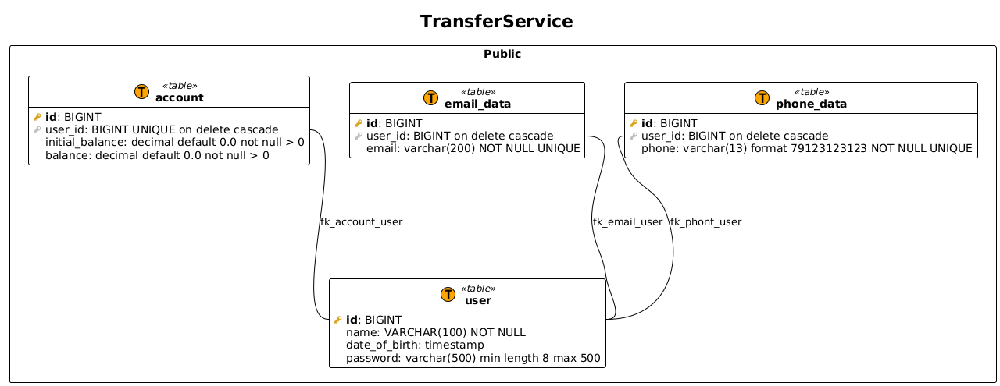

Тестовое задание

Тестовый сервис по переводу денег со счета на счет.

Необходимый стек:
1. Java 11
2. Spring boot
3. Spring Security
4. Maven
5. Flyway
6. Jwt
7. Scheduler
8. TestContainers

Функциональные требования:

1. Пользователь может менять только собственные данные
    1. Удалить, сменить, добавить email
    2. Удалить, сменить, добавить телефон
2. Поиск пользователей с фильтрацией по полям и пагинацией
    1. Если передана «dateOfBirth», то фильтр записей, где «date_of_birth» больше чем переданный в запросе.
    2. Если передан «phone», то фильтр по 100% сходству.
    3. Если передан «name», то фильтр по like форматом ‘{text-from-request-param}%’
    4. Если передан «email», то фильтр по 100% сходству.
3. Аутентификация по email+password or phone+password
4. Раз в 30 секунд BALANCE увеличивается на 10%, но не более 207% от начального депозита.
5. Трансфер денег от одного пользователя к другому. USER_ID(transfer from) мы берем из токена, TransferRequest (USER_ID (transfer to), VALUE)

Не функциональные требования:

1. Создание пользователей с BALANCE происходит при миграции.
2. Валидация по АПИ
3. Добавление JWT token (Claim только USER_ID). Не усложнять.
4. BALANCE не может быть ниже нуля.
5. Перевод транзакционный и потоко-безопасный.
6. Покрытие UNIT тестами. Интеграционное тестирование на трансфер. Остальное не значимо.

Дополнительные не обязательные требования:

1. Добавить swagger
2. Добавить логирование
3. Добавить кеширование на АПИ и на репозиторный слой.

Структура проекта:

ER:

Create token:

Token failed:

Transfer:

Transfer failed (Balance not enough):

Transfer failed (Concurrent changes):

Find users by parameters:

Update users:

Update user failed (less than one email):

Update user failed (Phone is already used):

Время на определение и описание требований - 25м.

Время на LLD - 4ч. 37мин.

Время на написание кода 23ч. 30м.
